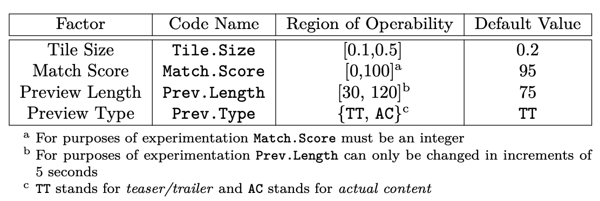
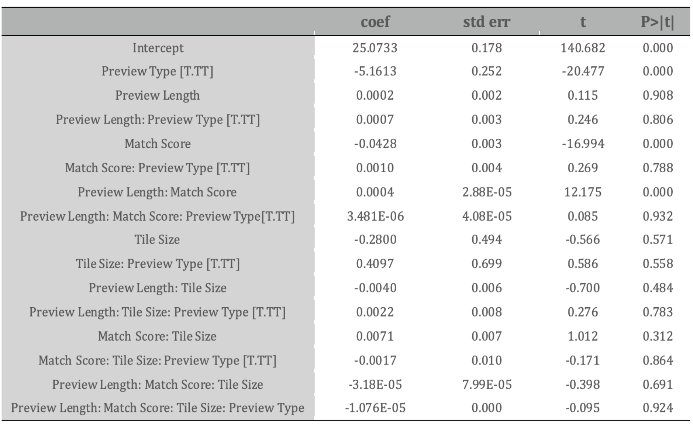
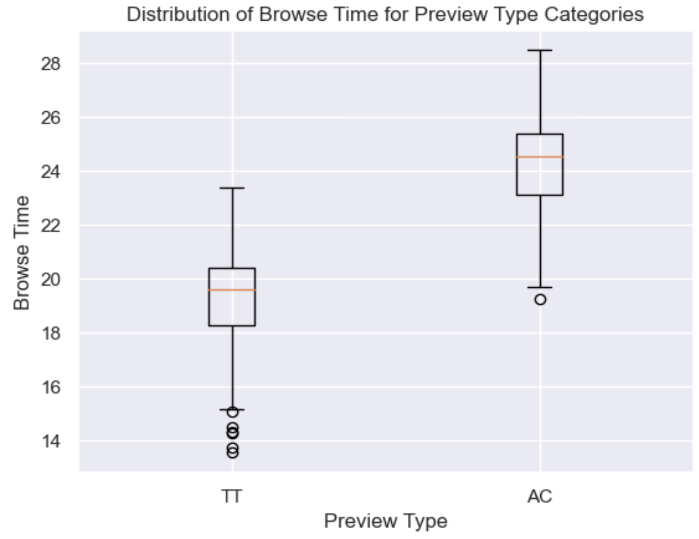
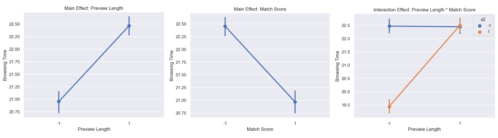
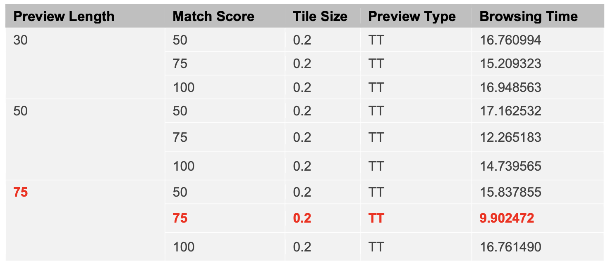
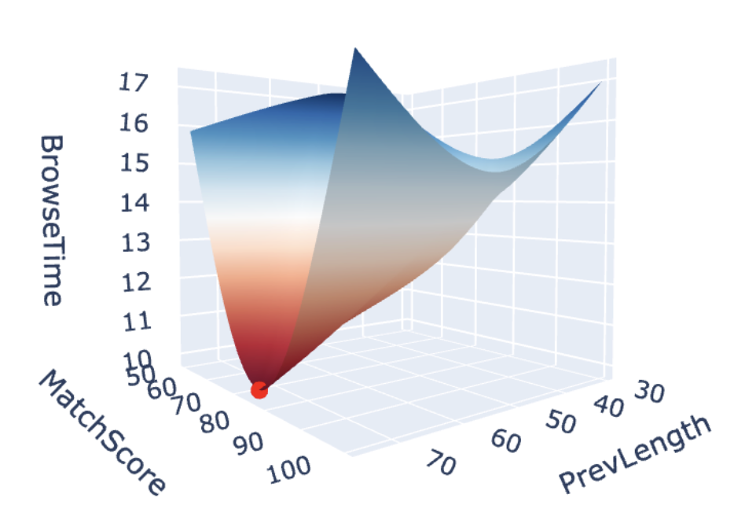
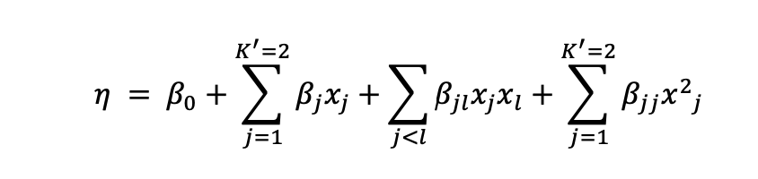
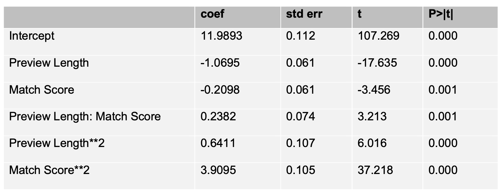
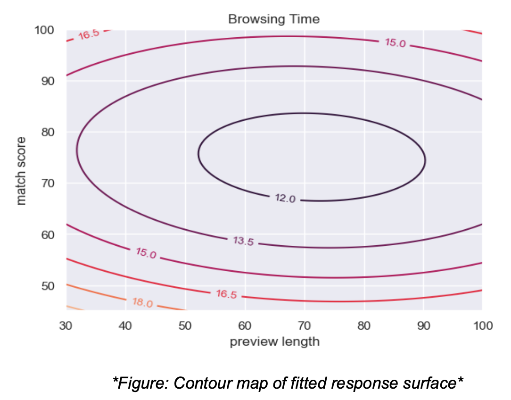

# AB Testing: Netflix Homepage Optimization Project

  

## Project problem and goal: 
In the competitive field of streaming entertainment, a user's ability to quickly identify content aligned with their tastes is crucial for service providers like Netflix. As the platform's content library expands, users can become overwhelmed, potentially leading to decision fatigue and a paradox of choice. Therefore, Netflix aimed to streamline its homepage experience, making the process of finding enjoyable content more efficient and thus increasing user satisfaction and retention rates. 

In this project, we aim to minimize the average browsing time on Netflix by experimenting with four factors related to the "Top Picks For..." section: **Tile Size** (the ratio affecting the number of visible tiles), **Match Score** (a percentage predicting viewing enjoyment), **Preview Length** (duration of previews in seconds), and **Preview Type** (the autoplayed preview style). This focused study seeks to understand and leverage what influences browsing time to enhance user experience.

The table below summarizes the region of operability for each of these factors, and the default values they take on when not being experimented with.

  

## About the dataset 
For our project, we'll utilize a dataset generated via the response surface simulator provided by Professor Nathaniel T Stevens (available at https://nathaniel-t-stevens.shinyapps.io/Netflix_Simulator_v4/). This simulator allows us to experiment with factors influencing browsing time on Netflix by uploading a design matrix in a .csv format specific to our group code. We can visualize our experimental design, run experiments to gather data on browsing times for various conditions, and download the results. Each experiment simulates the browsing behavior of 100 users per condition, focusing solely on the time spent browsing, excluding preview watching time.

## Structure of the experiments
- To reduce browsing time, we employed systematic experimental approaches using a 2k factorial design and response surface methodology to assess key interface elements: Tile Size, Match Score, Preview Length, and Preview Type.
- We began with an initial exploration of the factors influencing browsing time, utilizing factorial design principles, we analyzed the effects and interactions of these variables, with particular emphasis on the p- value to determine statistical significance and interaction plots to visualize their combined effects. In the subsequent phase, we refined the range of influential factors and iteratively honed in on the optimal settings. We continued this process, narrowing down the conditions in each iteration until reaching the ideal configuration. Through iterative refinement and Response Surface Methodology, we optimized these variables, culminating in an ideal configuration for enhanced user experience.

## Results and Visualizations of the experiments:
**1. Screening Experiment usinga 2k factorial design:** 
- Objective: Identify key factors affecting browsing time.
- Design: Utilized a 2^4 factorial design with Tile Size, Match Score, Preview Length, and Preview Type, requiring 16 setups, each with 100 user samples for comprehensive results.
- Data Collection: Adjusted each factor within specified ranges:
  - Tile Size (0.1 to 0.5)
  - Match Score (0 to 100)
  - Preview Length (30 to 120 seconds)
  - Preview Type ('TT' or 'AC')
- Data Analysis:
  - **Match Score, Preview Length, and Preview Type** were identified as key factors.
  - **Tile Size** had little effect; it remains at a default of 0.2 to avoid unnecessary changes and preserve the interface.
  - **Preview Type** showed no interaction effect; analysis focused on its direct impact, favoring the 'TT' setting for shorter browsing times.
 

  

  

**2. Identifying Optimal Range and Values for Preview Length and Match Score:** 
- Objective: Determine the best Match Score and Preview Length to reduce browsing time.
- Design: A 3x3 factorial design evaluated Match Score and Preview Length at three levels, involving 9 conditions with 100 samples each to study their effects on browsing time.

  

- Data Collection: Match Score (50, 75, 100) and Preview Length (30, 50, 75) were tested; Tile Size and Preview Type were set at defaults (0.2 and 'TT').
- Conclusion: After testing additional combinations, a Match Score and Preview Length of 75 were found to minimize browsing time to about 9.9 minutes.
Data Analysis: The results were analyzed to identify the combination that yielded the lowest browsing time.

  

  

**3. Decision Justification using Response Surface Methodology:** 
- Objective: Use RSM to determine optimal Match Score and Preview Length for shortest browsing time.
- Design: Applied quadratic model to Match Score and Preview Length, coded as -1 (low) and +1 (high), with Match Score (50, 100) and Preview Length (30, 75).
- Model: The model employs Taylor’s Theorem to form a secondary model, considering main effects, interaction effects, and quadratic effects of the two factors to approximate minimum browsing time. The response surface is defined by the equation:

  

The model summary table shows that our quadratic terms are both significant on a 1% significance level which indicates that we are near the quadratic curvature.

  

The following plot from the fitted model suggests an optimal browsing time near (70, 75). The calculated stationary point is (71.26, 75.04). Adjusting for constraints, the optimal conditions are identified as Preview Length = 70 seconds and Match Score = 75.

  

## Conclusion

- Result: Our methodical exploration through factorial design and Response Surface Methodology optimized the Netflix interface, reducing browsing time to 9.9 minutes with a Preview Length of 75 seconds, Match Score of 75, Preview Type "TT", and Tile Size 0.2. 

- Limitation & Future research: Our results are encouraging, but there are limitations. Our experiments didn't cover all user behaviors or preferences, and Netflix's changing algorithms and external factors like seasonality weren't considered. Recognizing these gaps, we see future research opportunities to broaden variables, extend study durations, and increase sample sizes for deeper insights and further user experience improvements. This groundwork paves the way for continuous, data-driven interface enhancements, aligning with Netflix's commitment to user satisfaction.

## Files and Directories:
- README.md: Contains the project description.
- images/: Directory containing all images and visualization files.
- ABTest_Netflix_code.ipynb: Jupyter Notebook with project code.

## Authors:
- Yen Phan
- Emily Yin
- Princewill Egbujor
- Varsha Moturi

